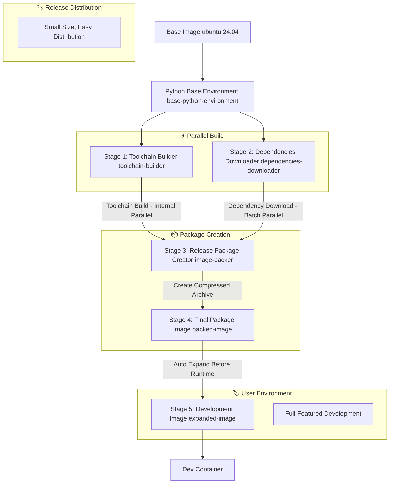

# 🐳 Clice Container Architecture

## Overview

The Clice container provides a comprehensive, pre-configured environment for C++ development with all necessary toolchains, compilers, and dependencies. This document details the container architecture, build stages, file structure, caching mechanisms, and usage methods.

## 🏗️ Multi-Stage Build Architecture

The container uses a sophisticated multi-stage Docker build to optimize both build time and image size, adopting a parallel build strategy:

### Architecture Flow Diagram



### Build Stages Detailed

#### Base Stage: Python Environment Foundation (`base-python-environment`)
**Purpose**: Establish consistent Python and uv environment foundation for all stages
**Base**: `ubuntu:24.04`

```dockerfile
FROM ubuntu:24.04 AS base-python-environment
ENV PATH="/root/.local/bin:${PATH}"
ENV UV_CACHE_DIR=${UV_CACHE_DIR}

# Copy project configuration to determine Python version
COPY config /clice/config
COPY docker/linux /clice/docker/linux

RUN --mount=type=cache,target=${APT_CACHE_DIR},sharing=locked \
    --mount=type=cache,target=${APT_STATE_CACHE_DIR},sharing=locked \
    --mount=type=cache,target=${UV_CACHE_DIR},sharing=locked \
    bash -eux - <<'SCRIPT'
    apt update
    apt install -y --no-install-recommends curl jq ca-certificates
    
    # Install uv for Python management
    curl -LsSf https://astral.sh/uv/install.sh | sh

    # Get Python version from configuration
    PYTHON_VERSION=$(jq -r .python /clice/config/default-toolchain-version.json)
    uv python install "$PYTHON_VERSION"
SCRIPT
```

**Installed Components**:
- `curl`, `jq`, `ca-certificates` - Essential system utilities for downloading and JSON processing
- `uv` - Modern Python package and project manager for consistent environment management
- **Dynamic Python Version** - Automatically installs Python version specified in configuration files

#### Stage 1: Toolchain Builder (`toolchain-builder`) - Parallel
**Purpose**: Build custom compiler toolchain (currently not implemented)
**Parallel Optimization**: Runs concurrently with dependencies downloader, uses internal parallel building
**Base**: `base-python-environment`

```dockerfile
FROM base-python-environment AS toolchain-builder
# Independent cache namespaces for parallel execution
RUN --mount=type=cache,target=${APT_CACHE_DIR},sharing=locked,id=toolchain-builder-apt \
    --mount=type=cache,target=${APT_STATE_CACHE_DIR},sharing=locked,id=toolchain-builder-apt-state \
    --mount=type=cache,target=${CACHE_DIR_ROOT},sharing=locked,id=toolchain-builder-cache \
    --mount=type=cache,target=${UV_CACHE_DIR},sharing=locked,id=toolchain-builder-uv \
    bash -eux - <<'SCRIPT'
    uv sync --project /clice/docker/linux/utility/pyproject.toml
    source /clice/docker/linux/utility/.venv/bin/activate
    python docker/linux/utility/build_clice_compiler_toolchain.py
SCRIPT
```

**Features**:
- **Independent Cache Namespace**: Uses `toolchain-builder-*` cache IDs for true parallel execution
- **Python-based Build System**: Uses uv for dependency management and Python scripts for build logic
- **Component Architecture**: Leverages component-based build system from build_config.py
- **Parallel Internal Processing**: Can build multiple compiler components simultaneously
- **Static Linking Support**: Can build static-linked libstdc++ for lower glibc compatibility

#### Stage 2: Dependencies Downloader (`dependencies-downloader`) - Parallel
**Purpose**: Download all development dependencies without installing them
**Parallel Optimization**: Runs concurrently with toolchain builder, uses internal batch parallel downloads
**Base**: `base-python-environment`

```dockerfile
FROM base-python-environment AS dependencies-downloader
# Independent cache namespaces for parallel execution
RUN --mount=type=cache,target=${APT_CACHE_DIR},sharing=locked,id=dependencies-downloader-apt \
    --mount=type=cache,target=${APT_STATE_CACHE_DIR},sharing=locked,id=dependencies-downloader-apt-state \
    --mount=type=cache,target=${CACHE_DIR_ROOT},sharing=locked,id=dependencies-downloader-cache \
    --mount=type=cache,target=${UV_CACHE_DIR},sharing=locked,id=dependencies-downloader-uv \
    bash -eux - <<'SCRIPT'
    uv sync --project /clice/docker/linux/utility/pyproject.toml
    source /clice/docker/linux/utility/.venv/bin/activate
    python docker/linux/utility/download_dependencies.py
SCRIPT
```

**Downloaded Components**:
- **APT Packages**: Complete dependency tree resolved using component-based architecture
- **CMake**: Binary installer with SHA-256 verification
- **XMake**: Platform-specific installation bundle
- **Python Dependencies**: Development tool packages managed by uv

**Parallel Optimization Features**:
- **Independent Cache Namespace**: Uses `dependencies-downloader-*` cache IDs
- **aria2c Multi-connection Downloads**: High-speed parallel downloads for individual files
- **Batch Processing**: APT packages downloaded in concurrent batches
- **Component-based Resolution**: Uses ALL_COMPONENTS registry for dynamic dependency management
- **Pre-resolved Dependency Trees**: Reduces download-time dependency lookups

**Cache Structure**:
```
${RELEASE_PACKAGE_DIR}/
├── apt-unknown/           # APT component packages and metadata
├── uv-unknown/           # UV component packages  
├── cmake-{version}/      # CMake component with version
├── xmake-{version}/      # XMake component with version
├── toolchain-unknown/    # Toolchain component container
│   ├── glibc-{version}/  # GNU C Library sub-component
│   ├── gcc-{version}/    # GNU Compiler Collection sub-component  
│   ├── llvm-{version}/   # LLVM Project sub-component
│   └── linux-{version}/  # Linux Kernel Headers sub-component
└── manifest.json         # Complete dependency manifest with ALL_COMPONENTS data

${PACKED_RELEASE_PACKAGE_PATH}  # Compressed archive (e.g., /release-pkg.tar.xz)
```

#### Stage 3: Release Package Creator (`image-packer`)
**Purpose**: Merge toolchain and dependencies into final release package for distribution
**Note**: This stage creates the compressed release package archive
**Base**: `base-python-environment`

```dockerfile
FROM base-python-environment AS image-packer
# Merge outputs from parallel stages
COPY --from=toolchain-builder ${RELEASE_PACKAGE_DIR} ${RELEASE_PACKAGE_DIR}
COPY --from=dependencies-downloader ${RELEASE_PACKAGE_DIR} ${RELEASE_PACKAGE_DIR}

# Independent cache namespace for package creation
RUN --mount=type=cache,target=${APT_CACHE_DIR},sharing=locked,id=packed-image-apt \
    --mount=type=cache,target=${APT_STATE_CACHE_DIR},sharing=locked,id=packed-image-apt-state \
    --mount=type=cache,target=${UV_CACHE_DIR},sharing=locked,id=packed-image-uv \
    bash -eux - <<'SCRIPT'
    uv sync --project /clice/docker/linux/utility/pyproject.toml
    source /clice/docker/linux/utility/.venv/bin/activate
    python docker/linux/utility/create_release_package.py
SCRIPT
```

**Release Package Creation Features**:
- **Independent Cache Namespace**: Uses `packed-image-*` cache IDs for isolation
- **Python-based Merging**: Uses create_release_package.py for intelligent component merging
- **Component Integration**: Merges outputs from parallel stages using component architecture
- **Manifest Generation**: Creates comprehensive manifest.json with ALL_COMPONENTS metadata
- **Parallel Task Execution**: Uses ParallelTaskScheduler for efficient package creation

#### Stage 4: Final Package Image (`packed-image`)
**Purpose**: Create the final distribution image with compressed release package
**Note**: This stage copies the compressed archive and environment configuration
**Base**: `base-python-environment`

```dockerfile
FROM base-python-environment AS packed-image  
COPY --from=image-packer ${PACKED_RELEASE_PACKAGE_PATH} ${PACKED_RELEASE_PACKAGE_PATH}
COPY --from=image-packer ${ENVIRONMENT_CONFIG_FILE} ${ENVIRONMENT_CONFIG_FILE}
```

**Final Package Features**:
- **Compressed Release Archive**: Contains `${PACKED_RELEASE_PACKAGE_PATH}` (e.g., `/release-pkg.tar.xz`)
- **Environment Configuration**: Includes pre-configured shell environment settings
- **Distribution Optimized**: Minimal size for efficient distribution and caching

#### Stage 5: Development Image (`expanded-image`) - Final Usage
**Purpose**: Fully expanded development environment - the final usable image  
**Note**: Auto-expanded from release package using Python-based setup
**Base**: Uses `${PACKED_IMAGE_NAME}` (the release image from previous stage)

```dockerfile
FROM ${PACKED_IMAGE_NAME} AS expanded-image
RUN bash -eux - <<'SCRIPT'
    # Use project-specific Python environment
    uv sync --project /clice/pyproject.toml
    source /clice/docker/linux/utility/.venv/bin/activate
    
    # Expand release package into full development environment
    python docker/linux/utility/local_setup.py
    
    # Clean up build artifacts to reduce final image size
    rm -rf /clice
SCRIPT
```

**Installed Components**:
- **Compilers**: GCC 14, Clang 20 (from official LLVM PPA)
- **Build Systems**: CMake (latest), XMake (latest)  
- **Development Tools**: Complete C++ development stack including debuggers and profilers
- **Runtime Libraries**: All necessary runtime dependencies

**Expansion Features**:
- **Python tarfile-based Extraction**: Consistent archive handling using Python's built-in tarfile module
- **Component-based Installation**: Uses component architecture for systematic tool installation
- **Size Optimization**: Removes build artifacts after expansion to minimize final image size
- **No Cache Dependencies**: Final expansion doesn't require build-time caches, suitable for end-user environments

**Development Container**: This is the final expanded, production-ready development environment

## 📁 Container File Structure

### Runtime Container Structure
```
/clice/                          # Project root directory (user workspace)
├── build/                       # Build output directory
├── cmake/                       # CMake configuration files
├── config/                      # Centralized configuration
│   ├── build_config.py          # Build configuration constants and component architecture
│   └── default-toolchain-version.json # Toolchain version definitions
├── docker/linux/utility/         # Container utility scripts
│   ├── build_utils.py            # Build utilities and parallel scheduler
│   ├── download_dependencies.py  # Dependency downloader
│   ├── create_release_package.py # Release package creator
│   └── local_setup.py            # Local environment setup
├── include/                      # C++ header files
├── src/                          # C++ source files
└── tests/                        # Test files
```

### Package Structure
```
${RELEASE_PACKAGE_DIR}/         # Component package directory (build-time)
├── apt-unknown/                # APT component packages and metadata
├── uv-unknown/                 # UV component packages
├── cmake-{version}/            # CMake component (versioned)
├── xmake-{version}/            # XMake component (versioned)
├── toolchain-unknown/          # Toolchain component container
│   ├── glibc-{version}/        # GNU C Library sub-component
│   ├── gcc-{version}/          # GNU Compiler Collection sub-component
│   ├── llvm-{version}/         # LLVM Project sub-component
│   └── linux-{version}/        # Linux Kernel Headers sub-component
└── manifest.json               # Complete component and dependency manifest

${PACKED_RELEASE_PACKAGE_PATH}   # Compressed release package (e.g., /release-pkg.tar.xz)

${ENVIRONMENT_CONFIG_FILE}       # Environment configuration file (e.g., /root/.bashrc)
```

### Dependency Manifest Structure
```json
{
  "timestamp": 1696723200,
  "components": {
    "apt-unknown": {
      "name": "apt",
      "version": "unknown",
      "type": "APTComponent",
      "package_dir": "${RELEASE_PACKAGE_DIR}/apt-unknown",
      "packages": [
        "git", "binutils", "bison", "build-essential", "g++-14", 
        "gawk", "gcc-14", "gnupg", "libstdc++-14-dev",
        "make", "rsync", "software-properties-common", "unzip", "xz-utils",
        "aria2", "apt-rdepends", "bzip2", "xz-utils"
      ],
      "package_count": 125
    },
    "uv-unknown": {
      "name": "uv",
      "version": "unknown", 
      "type": "UVComponent",
      "package_dir": "${RELEASE_PACKAGE_DIR}/uv-unknown"
    },
    "cmake-{version}": {
      "name": "cmake",
      "version": "3.28.3",
      "type": "CMakeComponent",
      "package_dir": "${RELEASE_PACKAGE_DIR}/cmake-3.28.3",
      "base_url": "https://github.com/Kitware/CMake/releases/download/v{version}",
      "tarball_name": "cmake-3.28.3-linux-x86_64.sh",
      "verification_name": "cmake-3.28.3-SHA-256.txt"
    },
    "xmake-{version}": {
      "name": "xmake",
      "version": "2.8.5",
      "type": "XMakeComponent", 
      "package_dir": "${RELEASE_PACKAGE_DIR}/xmake-2.8.5",
      "base_url": "https://github.com/xmake-io/xmake/releases/download/v{version}",
      "tarball_name": "xmake-bundle-v2.8.5.Linux.x86_64"
    },
    "toolchain-unknown": {
      "name": "toolchain",
      "version": "unknown",
      "type": "ToolchainComponent",
      "package_dir": "${RELEASE_PACKAGE_DIR}/toolchain-unknown",
      "sub_components": {
        "glibc-{version}": {
          "name": "glibc",
          "version": "2.39",
          "type": "GlibcSubComponent",
          "package_dir": "${RELEASE_PACKAGE_DIR}/toolchain-unknown/glibc-2.39",
          "base_url": "https://ftpmirror.gnu.org/gnu/glibc",
          "tarball_name": "glibc-2.39.tar.xz"
        },
        "gcc-{version}": {
          "name": "gcc", 
          "version": "14",
          "type": "GccSubComponent",
          "package_dir": "${RELEASE_PACKAGE_DIR}/toolchain-unknown/gcc-14",
          "base_url": "https://ftpmirror.gnu.org/gnu/gcc/gcc-14",
          "tarball_name": "gcc-14.tar.xz"
        },
        "llvm-{version}": {
          "name": "llvm",
          "version": "20.1.5", 
          "type": "LlvmSubComponent",
          "package_dir": "${RELEASE_PACKAGE_DIR}/toolchain-unknown/llvm-20.1.5",
          "base_url": "https://github.com/llvm/llvm-project/releases/download/llvmorg-20.1.5",
          "tarball_name": "llvm-project-20.1.5.src.tar.xz"
        },
        "linux-{version}": {
          "name": "linux",
          "version": "6.6",
          "type": "LinuxSubComponent", 
          "package_dir": "${RELEASE_PACKAGE_DIR}/toolchain-unknown/linux-6.6",
          "base_url": "https://github.com/torvalds/linux/archive/refs/tags",
          "tarball_name": "v6.6.tar.gz"
        }
      },
      "sysroot_dir": "${RELEASE_PACKAGE_DIR}/toolchain-unknown/sysroot/x86_64-linux-gnu/x86_64-linux-gnu/glibc2.39-libstdc++14-linux6.6"
    }
  },
  "build_stages": {
    "dependencies_downloader": ["apt-unknown", "uv-unknown", "cmake-{version}", "xmake-{version}"],
    "toolchain_builder": ["toolchain-unknown"]
  },
  "environment_variables": {
    "PATH": "/root/.local/bin:${PATH}",
    "XMAKE_ROOT": "y"
  }
}
```

## 🚀 Build Process

### Build Commands
```bash
# Build with default settings (clang + latest)
./docker/linux/build.sh

# Build with specific compiler and version
./docker/linux/build.sh --compiler gcc --version v1.2.3
```

### Build Process Flow
1. **Stage 1**: Install basic system packages
2. **Stage 2**: Download all dependencies to cache
3. **Stage 3**: Install dependencies from cache to final image
4. **Finalization**: Configure environment and create development-ready container

### Generated Images
**No distinction between dev and production builds**, unified image architecture:

- **Image Name**: `clice-io/clice:linux-{compiler}-{version}`
- **Image Types**:
  - **Release Image**: Distribution-optimized, contains compressed packages and cache, not directly usable
  - **Development Image**: Fully expanded development environment, final usable image
- **Examples**:
  - `clice-io/clice:linux-clang-latest`
  - `clice-io/clice:linux-gcc-v1.2.3`

**Important Notes**:
- Release image's main advantage is reducing user download image size
- Development image is the final expanded container, the environment users actually use
- Unified build process, no distinction between development and production environments

## 🏃 Container Usage

### Running Container
```bash
# Run with default settings
./docker/linux/run.sh

# Run with specific compiler and version  
./docker/linux/run.sh --compiler gcc --version v1.2.3

# Reset container (remove and recreate)
./docker/linux/run.sh --reset

# Update container image
./docker/linux/run.sh --update
```

### Container Management
- **Automatic Creation**: If container doesn't exist, it's created automatically
- **Version Checking**: Container image version is validated before use
- **Workspace Mounting**: Project directory is mounted to `/clice` in container
- **Persistent Storage**: Container persists between sessions

### Development Workflow
```bash
# 1. Build development container
./docker/linux/build.sh --compiler clang

# 2. Start development session
./docker/linux/run.sh --compiler clang

# 3. Inside container - build project
cd /clice
mkdir build && cd build
cmake .. -G Ninja -DCMAKE_BUILD_TYPE=Debug
ninja
```

## ⚡ Caching Strategy

### Independent Cache Namespaces
Each build stage uses separate cache IDs to enable true parallel execution:

#### Stage-Specific Cache IDs
- **Toolchain Builder**: `toolchain-builder-*`
  - `toolchain-builder-apt` - APT package cache
  - `toolchain-builder-apt-state` - APT state cache  
  - `toolchain-builder-cache` - General build cache
  - `toolchain-builder-uv` - UV Python package cache

- **Dependencies Downloader**: `dependencies-downloader-*`
  - `dependencies-downloader-apt` - APT package cache
  - `dependencies-downloader-apt-state` - APT state cache
  - `dependencies-downloader-cache` - Download cache
  - `dependencies-downloader-uv` - UV Python package cache

- **Release Package Creator**: `packed-image-*`
  - `packed-image-apt` - APT package cache
  - `packed-image-apt-state` - APT state cache
  - `packed-image-uv` - UV Python package cache

### Docker Layer Caching
- **Python Base Environment**: Cached independently, shared across all stages
- **Stage Outputs**: Each stage's output is cached as separate Docker layers
- **Parallel Stage Isolation**: Independent caches prevent conflicts during parallel execution

### Cache Optimization Benefits
- **True Parallel Execution**: Independent cache namespaces eliminate conflicts
- **Reduced Build Time**: Intelligent layer caching and component-based builds
- **Bandwidth Efficiency**: Downloads happen once per cache namespace
- **Offline Capability**: Complete dependency pre-resolution enables offline rebuilds
- **Selective Invalidation**: Changes to one component don't invalidate others

## 🛡️ Security & Verification

### Package Verification
- **CMake**: SHA-256 checksum verification of installer
- **APT Packages**: Standard APT signature verification
- **Dependency Tree**: Complete dependency resolution with `apt-rdepends`

### Build Isolation
- **Multi-stage**: Each stage is isolated and cacheable
- **Non-root User**: Development runs as non-root user where possible
- **Clean Environment**: Each build starts from clean base

## 🔧 Configuration Management

### Centralized Configuration
All container configuration is managed through `config/build_config.py`:

```python
# Version management
TOOLCHAIN_VERSIONS = {
    "cmake": "3.28.3",
    "xmake": "2.8.5",
    "gcc": "14", 
    "llvm": "20"
}

# Package lists
DEV_CONTAINER_BASIC_TOOLS = [
    "software-properties-common",
    "gnupg", "git", "xz-utils", "unzip", "make"
]
```

### Environment Variables
- `PKG_CACHE_DIR=/pkg-cache` - Package cache directory
- `DEBIAN_FRONTEND=noninteractive` - Non-interactive package installation
- `XMAKE_ROOT=y` - XMake root privileges

## 🚀 Performance Optimizations

### Parallel Processing Architecture
**Parallel optimization is implemented at three levels**:

#### Inter-Stage Parallelism (Docker Build Level)
- **Toolchain Builder** and **Dependencies Downloader** stages execute concurrently
- **Release Package Creator** waits for both parallel stages to complete
- Docker BuildKit automatically schedules parallel stage execution
- **Independent Cache Namespaces** prevent cache conflicts during parallel execution

#### Intra-Stage Parallelism (Component Level)
**Toolchain Builder Internal Parallelism**:
- Uses `ParallelTaskScheduler` for optimal job scheduling
- Compiler components built concurrently using `ProcessPoolExecutor`
- Multi-core CPU utilization for parallel compilation
- Component dependencies resolved using topological sorting

**Dependencies Downloader Internal Parallelism**:
- `aria2c` multi-connection downloads for individual files
- Batch processing of APT packages using parallel job execution
- Component-based parallel downloads (APT, tools, Python packages simultaneously)
- Pre-resolved dependency trees reduce download-time lookups

**Release Package Creator Parallelism**:
- Parallel component merging using job-based task scheduler
- Concurrent manifest generation and package compression
- Optimal resource utilization during final packaging stage

#### Cache Independence Architecture
Each stage operates with completely independent cache namespaces:
```dockerfile
# Toolchain Builder - Independent cache namespace
--mount=type=cache,target=${APT_CACHE_DIR},sharing=locked,id=toolchain-builder-apt
--mount=type=cache,target=${UV_CACHE_DIR},sharing=locked,id=toolchain-builder-uv

# Dependencies Downloader - Independent cache namespace  
--mount=type=cache,target=${APT_CACHE_DIR},sharing=locked,id=dependencies-downloader-apt
--mount=type=cache,target=${UV_CACHE_DIR},sharing=locked,id=dependencies-downloader-uv

# Release Package Creator - Independent cache namespace
--mount=type=cache,target=${APT_CACHE_DIR},sharing=locked,id=packed-image-apt
--mount=type=cache,target=${UV_CACHE_DIR},sharing=locked,id=packed-image-uv
```

### Build Optimization
- **Layer Caching**: Aggressive Docker layer caching strategy
- **Minimal Rebuilds**: Only changed components are rebuilt
- **Size Optimization**: Multi-stage builds minimize final image size
- **Cache Separation**: Release image serves as cache layer, Development image expands quickly

## 🔄 Maintenance & Updates

### Version Updates
Update versions in `config/default-toolchain-version.json`:
```json
{
  "cmake": "3.28.3",
  "xmake": "2.8.5", 
  "gcc": "14",
  "llvm": "20"
}
```

### Adding New Dependencies
1. Update package lists in `config/build_config.py`
2. Rebuild container with `./docker/linux/build.sh --rebuild`
3. Verify with `./docker/linux/run.sh --update`

### Container Health Checks
```bash
# Check container status
docker ps -f name=clice-linux-clang

# Verify development environment
./docker/linux/run.sh bash -c "cmake --version && xmake --version"

# Check package manifest
docker exec clice-linux-clang cat /pkg-cache/manifest.json
```

## 🎯 Best Practices

### Development Workflow
1. Use version-specific containers for reproducible builds
2. Reset containers when switching between major versions
3. Use `--update` to pull latest images regularly
4. Mount only necessary directories to avoid performance issues

### Container Management
1. Use descriptive version tags for release builds
2. Clean up unused containers and images periodically
3. Monitor container resource usage
4. Keep container configuration under version control

This architecture provides a robust, efficient, and maintainable development environment for the Clice project, with optimized build times, comprehensive toolchain support, and excellent developer experience.