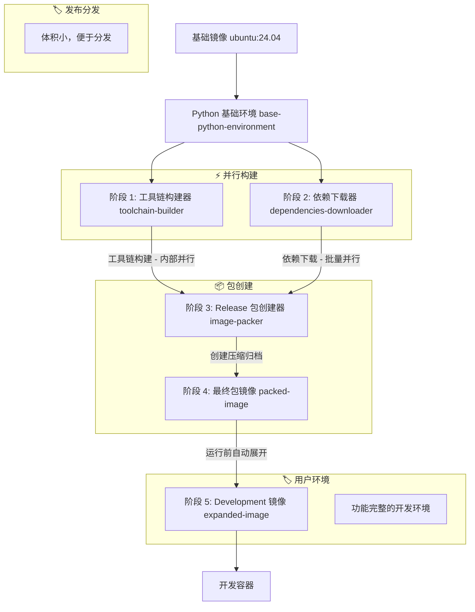

# 🐳 Clice 容器架构

## 概述

Clice 容器提供了一个全面、预配置的 C++ 开发环境，包含所有必要的工具链、编译器和依赖项。本文档详细说明了容器架构、构建阶段、文件结构、缓存机制和使用方法。

## 🏗️ 多阶段构建架构

容器使用复杂的多阶段 Docker 构建来优化构建时间和镜像大小，采用并行构建策略：

### 架构流程图



### 构建阶段详解

#### 基础阶段：Python 环境基础 (`base-python-environment`)
**目的**：为所有阶段建立一致的 Python 和 uv 环境基础
**基础镜像**：`ubuntu:24.04`

```dockerfile
FROM ubuntu:24.04 AS base-python-environment
ENV PATH="/root/.local/bin:${PATH}"
ENV UV_CACHE_DIR=${UV_CACHE_DIR}

# 复制项目配置以确定 Python 版本
COPY config /clice/config
COPY docker/linux /clice/docker/linux

RUN --mount=type=cache,target=${APT_CACHE_DIR},sharing=locked \
    --mount=type=cache,target=${APT_STATE_CACHE_DIR},sharing=locked \
    --mount=type=cache,target=${UV_CACHE_DIR},sharing=locked \
    bash -eux - <<'SCRIPT'
    apt update
    apt install -y --no-install-recommends curl jq ca-certificates
    
    # 安装 uv 用于 Python 管理
    curl -LsSf https://astral.sh/uv/install.sh | sh

    # 从配置获取 Python 版本
    PYTHON_VERSION=$(jq -r .python /clice/config/default-toolchain-version.json)
    uv python install "$PYTHON_VERSION"
SCRIPT
```

**安装的组件**：
- `curl`, `jq`, `ca-certificates` - 下载和 JSON 处理所需的基本系统工具
- `uv` - 现代 Python 包和项目管理器，用于一致的环境管理
- **动态 Python 版本** - 自动安装配置文件中指定的 Python 版本

#### 阶段 1：工具链构建器 (`toolchain-builder`) - 并行
**目的**：构建自定义编译器工具链（目前暂未实现）
**并行优化**：与依赖下载器同时运行，内部使用并行构建
**基础镜像**：`base-python-environment`

```dockerfile
FROM base-python-environment AS toolchain-builder
# 用于并行执行的独立缓存命名空间
RUN --mount=type=cache,target=${APT_CACHE_DIR},sharing=locked,id=toolchain-builder-apt \
    --mount=type=cache,target=${APT_STATE_CACHE_DIR},sharing=locked,id=toolchain-builder-apt-state \
    --mount=type=cache,target=${CACHE_DIR_ROOT},sharing=locked,id=toolchain-builder-cache \
    --mount=type=cache,target=${UV_CACHE_DIR},sharing=locked,id=toolchain-builder-uv \
    bash -eux - <<'SCRIPT'
    uv sync --project /clice/docker/linux/utility/pyproject.toml
    source /clice/docker/linux/utility/.venv/bin/activate
    python docker/linux/utility/build_clice_compiler_toolchain.py
SCRIPT
```

**特点**：
- **独立缓存命名空间**：使用 `toolchain-builder-*` 缓存 ID 实现真正的并行执行
- **基于 Python 的构建系统**：使用 uv 进行依赖管理，Python 脚本处理构建逻辑
- **组件架构**：利用 build_config.py 中基于组件的构建系统
- **并行内部处理**：可以同时构建多个编译器组件
- **静态链接支持**：可构建静态链接的 libstdc++ 以兼容更低版本的 glibc

#### 阶段 2：依赖下载器 (`dependencies-downloader`) - 并行
**目的**：下载所有开发依赖项而不安装它们
**并行优化**：与工具链构建器同时运行，内部批量并行下载
**基础镜像**：`base-python-environment`

```dockerfile
FROM base-python-environment AS dependencies-downloader
# 用于并行执行的独立缓存命名空间
RUN --mount=type=cache,target=${APT_CACHE_DIR},sharing=locked,id=dependencies-downloader-apt \
    --mount=type=cache,target=${APT_STATE_CACHE_DIR},sharing=locked,id=dependencies-downloader-apt-state \
    --mount=type=cache,target=${CACHE_DIR_ROOT},sharing=locked,id=dependencies-downloader-cache \
    --mount=type=cache,target=${UV_CACHE_DIR},sharing=locked,id=dependencies-downloader-uv \
    bash -eux - <<'SCRIPT'
    uv sync --project /clice/docker/linux/utility/pyproject.toml
    source /clice/docker/linux/utility/.venv/bin/activate
    python docker/linux/utility/download_dependencies.py
SCRIPT
```

**下载的组件**：
- **APT 包**：使用基于组件架构解析的完整依赖树
- **CMake**：带 SHA-256 验证的二进制安装程序
- **XMake**：平台特定的安装包
- **Python 依赖**：由 uv 管理的开发工具包

**并行优化特性**：
- **独立缓存命名空间**：使用 `dependencies-downloader-*` 缓存 ID
- **aria2c 多连接下载**：单个文件的高速并行下载
- **批处理**：APT 包并发批量下载
- **基于组件的解析**：使用 ALL_COMPONENTS 注册表进行动态依赖管理
- **预解析依赖树**：减少下载时的依赖查找开销

**缓存结构**：
```
${RELEASE_PACKAGE_DIR}/
├── apt-unknown/           # APT 组件包和元数据
├── uv-unknown/           # UV 组件包  
├── cmake-{version}/      # 带版本的 CMake 组件
├── xmake-{version}/      # 带版本的 XMake 组件
├── toolchain-unknown/    # 工具链组件容器
│   ├── glibc-{version}/  # GNU C 库子组件
│   ├── gcc-{version}/    # GNU 编译器集合子组件  
│   ├── llvm-{version}/   # LLVM 项目子组件
│   └── linux-{version}/  # Linux 内核头文件子组件
└── manifest.json         # 包含 ALL_COMPONENTS 数据的完整依赖清单

${PACKED_RELEASE_PACKAGE_PATH}  # 压缩归档（如 /release-pkg.tar.xz）
```

#### 阶段 3：Release 包创建器 (`image-packer`)
**目的**：将工具链和依赖合并为用于分发的最终 release 包
**特点**：此阶段创建压缩的 release 包归档
**基础镜像**：`base-python-environment`

```dockerfile
FROM base-python-environment AS image-packer
# 合并并行阶段的输出
COPY --from=toolchain-builder ${RELEASE_PACKAGE_DIR} ${RELEASE_PACKAGE_DIR}
COPY --from=dependencies-downloader ${RELEASE_PACKAGE_DIR} ${RELEASE_PACKAGE_DIR}

# 用于包创建的独立缓存命名空间
RUN --mount=type=cache,target=${APT_CACHE_DIR},sharing=locked,id=packed-image-apt \
    --mount=type=cache,target=${APT_STATE_CACHE_DIR},sharing=locked,id=packed-image-apt-state \
    --mount=type=cache,target=${UV_CACHE_DIR},sharing=locked,id=packed-image-uv \
    bash -eux - <<'SCRIPT'
    uv sync --project /clice/docker/linux/utility/pyproject.toml
    source /clice/docker/linux/utility/.venv/bin/activate
    python docker/linux/utility/create_release_package.py
SCRIPT
```

**Release 包创建特性**：
- **独立缓存命名空间**：使用 `packed-image-*` 缓存 ID 进行隔离
- **基于 Python 的合并**：使用 create_release_package.py 进行智能组件合并
- **组件集成**：使用组件架构合并并行阶段的输出
- **清单生成**：创建包含 ALL_COMPONENTS 元数据的综合 manifest.json
- **并行任务执行**：使用 ParallelTaskScheduler 进行高效的包创建

#### 阶段 4：最终包镜像 (`packed-image`)
**目的**：创建包含压缩 release 包的最终分发镜像
**特点**：此阶段复制压缩归档和环境配置
**基础镜像**：`base-python-environment`

```dockerfile
FROM base-python-environment AS packed-image  
COPY --from=image-packer ${PACKED_RELEASE_PACKAGE_PATH} ${PACKED_RELEASE_PACKAGE_PATH}
COPY --from=image-packer ${ENVIRONMENT_CONFIG_FILE} ${ENVIRONMENT_CONFIG_FILE}
```

**最终包特性**：
- **压缩 Release 归档**：包含 `${PACKED_RELEASE_PACKAGE_PATH}`（如 `/release-pkg.tar.xz`）
- **环境配置**：包含预配置的 shell 环境设置
- **分发优化**：最小尺寸以实现高效分发和缓存

#### 阶段 5：Development 镜像 (`expanded-image`) - 最终使用
**目的**：完全展开的开发环境 - 最终可用的镜像
**特点**：使用基于 Python 的设置从 release 包自动展开
**基础镜像**：使用 `${PACKED_IMAGE_NAME}`（来自前一阶段的 release 镜像）

```dockerfile
FROM ${PACKED_IMAGE_NAME} AS expanded-image
RUN bash -eux - <<'SCRIPT'
    # 使用项目特定的 Python 环境
    uv sync --project /clice/pyproject.toml
    source /clice/docker/linux/utility/.venv/bin/activate
    
    # 将 release 包展开为完整的开发环境
    python docker/linux/utility/local_setup.py
    
    # 清理构建工件以减少最终镜像大小
    rm -rf /clice
SCRIPT
```

**安装的组件**：
- **编译器**：GCC 14、Clang 20（来自官方 LLVM PPA）
- **构建系统**：CMake（最新版）、XMake（最新版）
- **开发工具**：完整的 C++ 开发栈，包括调试器和分析器
- **运行时库**：所有必要的运行时依赖

**展开特性**：
- **基于 Python tarfile 的提取**：使用 Python 内置 tarfile 模块进行一致的归档处理
- **基于组件的安装**：使用组件架构进行系统的工具安装
- **大小优化**：展开后删除构建工件以最小化最终镜像大小
- **无缓存依赖**：最终展开不需要构建时缓存，适合最终用户环境

**Development 容器**：这是最终展开的、可用于生产的开发环境

## 📁 容器文件结构

### 运行时容器结构
```
/clice/                          # 项目根目录（用户工作空间）
├── build/                       # 构建输出目录
├── cmake/                       # CMake 配置文件
├── config/                      # 集中配置
│   ├── build_config.py          # 构建配置常量和组件架构
│   └── default-toolchain-version.json # 工具链版本定义
├── docker/linux/utility/         # 容器实用程序脚本
│   ├── build_utils.py            # 构建实用程序和并行调度器
│   ├── download_dependencies.py  # 依赖下载器
│   ├── create_release_package.py # Release包创建器
│   └── local_setup.py            # 本地环境设置
├── include/                      # C++ 头文件
├── src/                          # C++ 源文件
└── tests/                        # 测试文件
```

### 打包结构
```
${RELEASE_PACKAGE_DIR}/         # 组件包目录（构建时）
├── apt-unknown/                # APT 组件包和元数据
├── uv-unknown/                 # UV 组件包
├── cmake-{version}/            # CMake 组件（带版本）
├── xmake-{version}/            # XMake 组件（带版本）
├── toolchain-unknown/          # 工具链组件容器
│   ├── glibc-{version}/        # GNU C 库子组件
│   ├── gcc-{version}/          # GNU 编译器集合子组件
│   ├── llvm-{version}/         # LLVM 项目子组件
│   └── linux-{version}/        # Linux 内核头文件子组件
└── manifest.json               # 完整组件和依赖清单

${PACKED_RELEASE_PACKAGE_PATH}  # 压缩发布包（如 /release-pkg.tar.xz）

${ENVIRONMENT_CONFIG_FILE}       # 环境配置文件（如 /root/.bashrc）
```

### 依赖清单结构
```json
{
  "timestamp": 1696723200,
  "components": {
    "apt-unknown": {
      "name": "apt",
      "version": "unknown",
      "type": "APTComponent",
      "package_dir": "${RELEASE_PACKAGE_DIR}/apt-unknown",
      "packages": [
        "git", "binutils", "bison", "build-essential", "g++-14", 
        "gawk", "gcc-14", "gnupg", "libstdc++-14-dev",
        "make", "rsync", "software-properties-common", "unzip", "xz-utils",
        "aria2", "apt-rdepends", "bzip2", "xz-utils"
      ],
      "package_count": 125
    },
    "uv-unknown": {
      "name": "uv",
      "version": "unknown", 
      "type": "UVComponent",
      "package_dir": "${RELEASE_PACKAGE_DIR}/uv-unknown"
    },
    "cmake-{version}": {
      "name": "cmake",
      "version": "3.28.3",
      "type": "CMakeComponent",
      "package_dir": "${RELEASE_PACKAGE_DIR}/cmake-3.28.3",
      "base_url": "https://github.com/Kitware/CMake/releases/download/v{version}",
      "tarball_name": "cmake-3.28.3-linux-x86_64.sh",
      "verification_name": "cmake-3.28.3-SHA-256.txt"
    },
    "xmake-{version}": {
      "name": "xmake",
      "version": "2.8.5",
      "type": "XMakeComponent", 
      "package_dir": "${RELEASE_PACKAGE_DIR}/xmake-2.8.5",
      "base_url": "https://github.com/xmake-io/xmake/releases/download/v{version}",
      "tarball_name": "xmake-bundle-v2.8.5.Linux.x86_64"
    },
    "toolchain-unknown": {
      "name": "toolchain",
      "version": "unknown",
      "type": "ToolchainComponent",
      "package_dir": "${RELEASE_PACKAGE_DIR}/toolchain-unknown",
      "sub_components": {
        "glibc-{version}": {
          "name": "glibc",
          "version": "2.39",
          "type": "GlibcSubComponent",
          "package_dir": "${RELEASE_PACKAGE_DIR}/toolchain-unknown/glibc-2.39",
          "base_url": "https://ftpmirror.gnu.org/gnu/glibc",
          "tarball_name": "glibc-2.39.tar.xz"
        },
        "gcc-{version}": {
          "name": "gcc", 
          "version": "14",
          "type": "GccSubComponent",
          "package_dir": "${RELEASE_PACKAGE_DIR}/toolchain-unknown/gcc-14",
          "base_url": "https://ftpmirror.gnu.org/gnu/gcc/gcc-14",
          "tarball_name": "gcc-14.tar.xz"
        },
        "llvm-{version}": {
          "name": "llvm",
          "version": "20.1.5", 
          "type": "LlvmSubComponent",
          "package_dir": "${RELEASE_PACKAGE_DIR}/toolchain-unknown/llvm-20.1.5",
          "base_url": "https://github.com/llvm/llvm-project/releases/download/llvmorg-20.1.5",
          "tarball_name": "llvm-project-20.1.5.src.tar.xz"
        },
        "linux-{version}": {
          "name": "linux",
          "version": "6.6",
          "type": "LinuxSubComponent", 
          "package_dir": "${RELEASE_PACKAGE_DIR}/toolchain-unknown/linux-6.6",
          "base_url": "https://github.com/torvalds/linux/archive/refs/tags",
          "tarball_name": "v6.6.tar.gz"
        }
      },
      "sysroot_dir": "${RELEASE_PACKAGE_DIR}/toolchain-unknown/sysroot/x86_64-linux-gnu/x86_64-linux-gnu/glibc2.39-libstdc++14-linux6.6"
    }
  },
  "build_stages": {
    "dependencies_downloader": ["apt-unknown", "uv-unknown", "cmake-{version}", "xmake-{version}"],
    "toolchain_builder": ["toolchain-unknown"]
  },
  "environment_variables": {
    "PATH": "/root/.local/bin:${PATH}",
    "XMAKE_ROOT": "y"
  }
}
```

## 🚀 构建过程

### 构建命令
```bash
# 使用默认设置构建（clang + latest）
./docker/linux/build.sh

# 使用特定编译器和版本构建
./docker/linux/build.sh --compiler gcc --version v1.2.3
```

### 构建过程流程
1. **阶段 1**：安装基本系统包
2. **阶段 2**：将所有依赖下载到缓存
3. **阶段 3**：从缓存安装依赖到最终镜像
4. **最终化**：配置环境并创建开发就绪容器

### 生成的镜像
**构建镜像不分 dev 和生产**，统一的镜像架构：

- **镜像名称**：`clice-io/clice:linux-{compiler}-{version}`
- **镜像类型**：
  - **Release 镜像**：便于分发，包含压缩包和缓存，不能直接使用
  - **Development 镜像**：完全展开的开发环境，最终使用的镜像
- **示例**：
  - `clice-io/clice:linux-clang-latest`
  - `clice-io/clice:linux-gcc-v1.2.3`

**重要说明**：
- Release 镜像主要优势是降低用户下载的镜像大小
- Development 镜像是最终展开的容器，用户实际使用的环境
- 构建过程统一，不区分开发和生产环境

## 🏃 容器使用

### 运行容器
```bash
# 使用默认设置运行
./docker/linux/run.sh

# 使用特定编译器和版本运行
./docker/linux/run.sh --compiler gcc --version v1.2.3

# 重置容器（删除并重新创建）
./docker/linux/run.sh --reset

# 更新容器镜像
./docker/linux/run.sh --update
```

### 容器管理
- **自动创建**：如果容器不存在，会自动创建
- **版本检查**：使用前会验证容器镜像版本
- **工作区挂载**：项目目录挂载到容器中的 `/clice`
- **持久存储**：容器在会话之间保持持久

### 开发工作流程
```bash
# 1. 构建开发容器
./docker/linux/build.sh --compiler clang

# 2. 开始开发会话
./docker/linux/run.sh --compiler clang

# 3. 在容器内 - 构建项目
cd /clice
mkdir build && cd build
cmake .. -G Ninja -DCMAKE_BUILD_TYPE=Debug
ninja
```

## ⚡ 缓存策略

### 独立缓存命名空间
每个构建阶段使用独立的缓存 ID 以实现真正的并行执行：

#### 阶段特定缓存 ID
- **工具链构建器**：`toolchain-builder-*`
  - `toolchain-builder-apt` - APT 包缓存
  - `toolchain-builder-apt-state` - APT 状态缓存
  - `toolchain-builder-cache` - 通用构建缓存
  - `toolchain-builder-uv` - UV Python 包缓存

- **依赖下载器**：`dependencies-downloader-*`
  - `dependencies-downloader-apt` - APT 包缓存
  - `dependencies-downloader-apt-state` - APT 状态缓存
  - `dependencies-downloader-cache` - 下载缓存
  - `dependencies-downloader-uv` - UV Python 包缓存

- **Release 包创建器**：`packed-image-*`
  - `packed-image-apt` - APT 包缓存
  - `packed-image-apt-state` - APT 状态缓存
  - `packed-image-uv` - UV Python 包缓存

### Docker 层缓存
- **Python 基础环境**：独立缓存，在所有阶段间共享
- **阶段输出**：每个阶段的输出作为独立的 Docker 层缓存
- **并行阶段隔离**：独立缓存防止并行执行期间的冲突

### 缓存优化优势
- **真正的并行执行**：独立缓存命名空间消除冲突
- **减少构建时间**：智能层缓存和基于组件的构建
- **带宽效率**：每个缓存命名空间下载只发生一次
- **离线能力**：完整依赖预解析使离线重建成为可能
- **选择性失效**：一个组件的更改不会使其他组件失效

## 🛡️ 安全和验证

### 包验证
- **CMake**：安装程序的 SHA-256 校验和验证
- **APT 包**：标准 APT 签名验证
- **依赖树**：使用 `apt-rdepends` 完整依赖解析

### 构建隔离
- **多阶段**：每个阶段都是隔离和可缓存的
- **非 root 用户**：开发尽可能以非 root 用户运行
- **清洁环境**：每次构建都从清洁基础开始

## 🔧 配置管理

### 集中配置
所有容器配置通过 `config/build_config.py` 管理：

```python
# 版本管理
TOOLCHAIN_VERSIONS = {
    "cmake": "3.28.3",
    "xmake": "2.8.5",
    "gcc": "14", 
    "llvm": "20"
}

# 包列表
DEV_CONTAINER_BASIC_TOOLS = [
    "software-properties-common",
    "gnupg", "git", "xz-utils", "unzip", "make"
]
```

### 环境变量
- `PKG_CACHE_DIR=/pkg-cache` - 包缓存目录
- `DEBIAN_FRONTEND=noninteractive` - 非交互式包安装
- `XMAKE_ROOT=y` - XMake root 权限

## 🚀 性能优化

### 并行处理架构
**并行优化在三个层面实现**：

#### Stage 间并行（Docker 构建层面）
- **工具链构建器** 和 **依赖下载器** 阶段并发执行
- **Release 包创建器** 等待两个并行阶段完成
- Docker BuildKit 自动调度并行阶段执行
- **独立缓存命名空间** 防止并行执行期间的缓存冲突

#### Stage 内并行（组件层面）
**工具链构建器内部并行**：
- 使用 `ParallelTaskScheduler` 进行最优作业调度
- 使用 `ProcessPoolExecutor` 并发构建编译器组件
- 多核 CPU 利用率用于并行编译
- 使用拓扑排序解析组件依赖

**依赖下载器内部并行**：
- `aria2c` 多连接下载单个文件
- 使用并行作业执行的 APT 包批处理
- 基于组件的并行下载（APT、工具、Python 包同时进行）
- 预解析依赖树减少下载时查找

**Release 包创建器并行**：
- 使用基于作业的任务调度器并行组件合并
- 并发清单生成和包压缩
- 最终打包阶段的最优资源利用

#### 缓存独立架构
每个阶段使用完全独立的缓存命名空间操作：
```dockerfile
# 工具链构建器 - 独立缓存命名空间
--mount=type=cache,target=${APT_CACHE_DIR},sharing=locked,id=toolchain-builder-apt
--mount=type=cache,target=${UV_CACHE_DIR},sharing=locked,id=toolchain-builder-uv

# 依赖下载器 - 独立缓存命名空间  
--mount=type=cache,target=${APT_CACHE_DIR},sharing=locked,id=dependencies-downloader-apt
--mount=type=cache,target=${UV_CACHE_DIR},sharing=locked,id=dependencies-downloader-uv

# Release 包创建器 - 独立缓存命名空间
--mount=type=cache,target=${APT_CACHE_DIR},sharing=locked,id=packed-image-apt
--mount=type=cache,target=${UV_CACHE_DIR},sharing=locked,id=packed-image-uv
```

### 构建优化
- **层缓存**：积极的 Docker 层缓存策略
- **最小重建**：只重建更改的组件
- **大小优化**：多阶段构建最小化最终镜像大小
- **缓存分离**：Release 镜像作为缓存层，Development 镜像快速展开

## 🔄 维护和更新

### 版本更新
更新 `config/default-toolchain-version.json` 中的版本：
```json
{
  "cmake": "3.28.3",
  "xmake": "2.8.5", 
  "gcc": "14",
  "llvm": "20"
}
```

### 添加新依赖
1. 更新 `config/build_config.py` 中的包列表
2. 使用 `./docker/linux/build.sh --rebuild` 重建容器
3. 使用 `./docker/linux/run.sh --reset` 验证

### 容器健康检查
```bash
# 检查容器状态
docker ps -f name=clice-linux-clang

# 验证开发环境
./docker/linux/run.sh bash -c "cmake --version && xmake --version"

# 检查包清单
docker exec clice-linux-clang cat /pkg-cache/manifest.json
```

## 🎯 最佳实践

### 开发工作流程
1. 使用版本特定的容器进行可重现构建
2. 在主要版本之间切换时重置容器
3. 定期使用 `--update` 拉取最新镜像
4. 仅挂载必要目录以避免性能问题

### 容器管理
1. 为发布构建使用描述性版本标签
2. 定期清理未使用的容器和镜像
3. 监控容器资源使用情况
4. 将容器配置保持在版本控制下

此架构为 Clice 项目提供了强大、高效和可维护的开发环境，具有优化的构建时间、全面的工具链支持和出色的开发者体验。